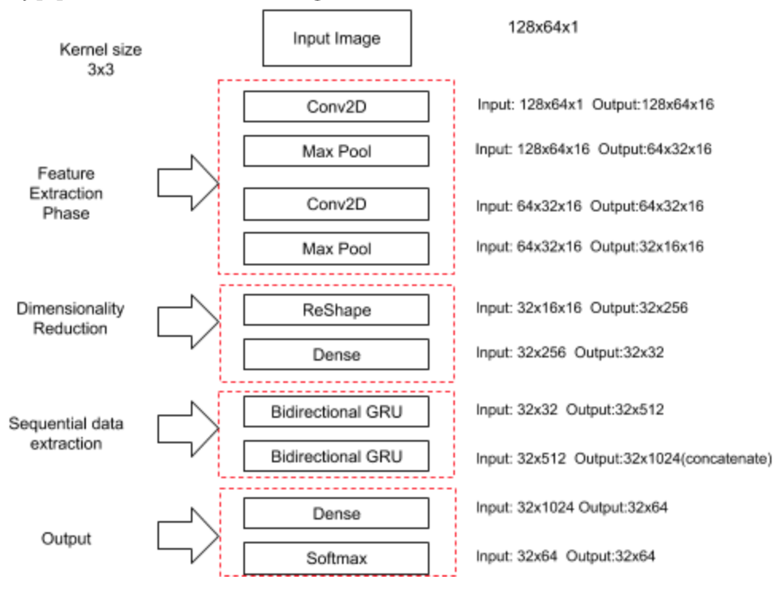

# ocr_using_ctc_loss
Optical Character recognition for licence plates using connectionist temporal classification loss

### Introduction

This is an optical character recognition technique that leverages deep learning  mechanism to make predictions about what particular character or word is in an image which in our case which is licence plate detection.
I have used CTC loss along with a convoluted bi-GRU network.
Connectionist Temporal Classification (CTC) is a way to get around not knowing the alignment between the input and the output. As we’ll see, it’s especially well suited to applications like speech and character recognition in images.

### Model Structure

The model input is image data, and we first feed the data to two convolutional networks to extract the image features, followed by the Reshape and Dense to reduce the dimensions of the feature vectors before letting the bidirectional GRU process the sequential data. The sequential data feed to the GRU is the horizontally divided image features. The final output Dense layer transforms the output for a given image to an array with the shape of (32, 28) representing (#of horizontal steps, #char labels).

### Training
We use architecture followed in the OCR example provided in the Official Keras GitHub repository. The model structure is given below.

 

The output from network having size (32x64). Here the 32 represents the number of timesteps and 64 represents the possible characters(26 small letters, 26 capital letters, 10 digits, space and blank).
Since the text could be anywhere in the space, to locate each character in the image we use Connectionist Temporal Classification(CTC). We have 32 timesteps. But the word may not have that much length. CTC using blank token to separate the characters. It helps to merge repeating characters without separated by blank.

In the decoding phase, following actions take place.
- Collapse repeating characters without separated by blank. So, as in given below, two ‘o’s will get merged as they are not separated by blank.
- Then remove blank tokens.

### Testing
Some of the results of predicted licence number plate is shown in **ocr_infer.ipynb**. 
