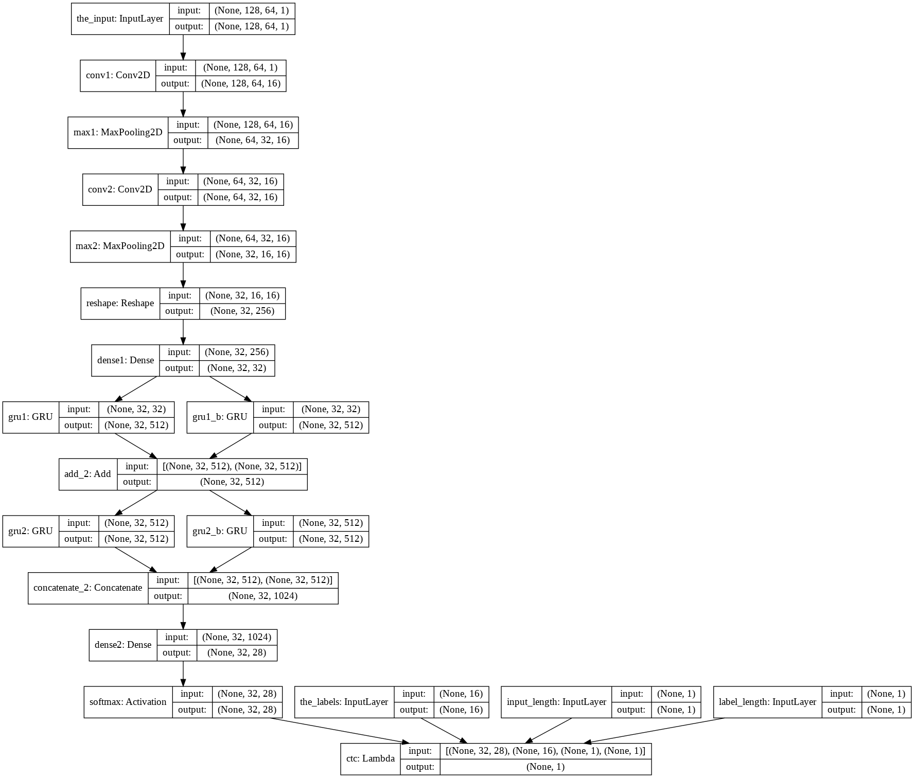

# ocr_using_ctc_loss
Optical Character recognition for licence plates using connectionist temporal classification loss

### Introduction

What we are dealing with is an optical character recognition technique that leverages deep learning  mechanism to make predictions about what a particular character or word in an image in our case which is licence plate detection.
Connectionist Temporal Classification (CTC) is a way to get around not knowing the alignment between the input and the output. As we’ll see, it’s especially well suited to applications like speech and handwriting recognition.

### Model Structure

The model input is image data, and we first feed the data to two convolutional networks to extract the image features, followed by the Reshape and Dense to reduce the dimensions of the feature vectors before letting the bidirectional GRU process the sequential data. The sequential data feed to the GRU is the horizontally divided image features. The final output Dense layer transforms the output for a given image to an array with the shape of (32, 28) representing (#of horizontal steps, #char labels).

 

